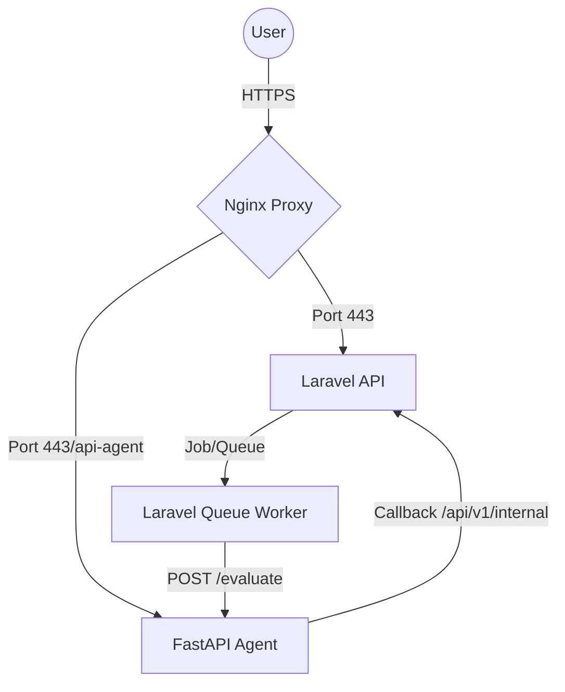

# 🚀 VPS Deployment & Infrastructure Guide
**AI Review Engine (Paper Review FastTrackEdu)**

Panduan ini berisi dokumentasi teknis lengkap tentang cara mengelola, memantau, dan memperbarui sistem AI Review Engine di lingkungan VPS (Ubuntu 24.04 / Tencent Cloud).

---

## 🏗️ Arsitektur Proyek
Sistem ini terdiri dari tiga komponen utama yang saling berkomunikasi:
1.  **Frontend (React/Vite)**: Di-build menjadi statis dan dilayani oleh Nginx.
2.  **Backend (Laravel)**: API utama dan pengelolaan database.
3.  **AI Agent (FastAPI)**: Otak AI yang menjalankan LangGraph dan LLM.

### Skema Komunikasi Internal


---

## 🛠️ Setup Awal (Prerequisites)

### 1. Dependensi Sistem
Pastikan VPS memiliki komponen berikut:
- **PHP 8.2+** (untuk Laravel)
- **Python 3.10+** (untuk AI Agent)
- **Node.js 18+** (untuk build Frontend)
- **Nginx** (Web Server & Reverse Proxy)
- **Redis** (Untuk Queue & Caching)

### 2. Struktur Direktori
Proyek ini diletakkan di: `/var/www/html/agent-review-fastrack/`
- `/backend` : Folder Laravel.
- `/ai-agent` : Folder FastAPI Python.

### 3. Konfigurasi Izin (Permissions)
Agar Laravel dan AI Agent bisa menulis log dan file, jalankan:
```bash
sudo chown -R ubuntu:www-data /var/www/html/agent-review-fastrack
sudo chmod -R 775 /var/www/html/agent-review-fastrack/backend/storage
sudo chmod -R 775 /var/www/html/agent-review-fastrack/backend/bootstrap/cache
```

---

## ⚙️ Konfigurasi Environment (.env)

### Backend (Laravel)
Pastikan variable berikut sinkron dengan Agent:
```env
INTERNAL_BASE_URL=https://aireview.fastrackedu.id
INTERNAL_KEY=super-secret-key-anda
```

### AI Agent
Berlokasi di `ai-agent/.env`:
```env
LARAVEL_URL=https://aireview.fastrackedu.id
INTERNAL_KEY=super-secret-key-anda (Wajib sama dengan Backend)
GROQ_API_KEY=your-key
```

---

## 🔄 Persistence (Systemd Services)
Dua layanan utama harus dikelola oleh `systemd` agar otomatis menyala saat reboot.

### 1. AI Agent Service (`/etc/systemd/system/ai-agent.service`)
```ini
[Unit]
Description=AI Review Agent Service
After=network.target

[Service]
User=ubuntu
Group=www-data
WorkingDirectory=/var/www/html/agent-review-fastrack/ai-agent
Environment=PATH=/var/www/html/agent-review-fastrack/ai-agent/.venv/bin:/usr/local/sbin:/usr/local/bin:/usr/sbin:/usr/bin:/sbin:/bin
ExecStart=/var/www/html/agent-review-fastrack/ai-agent/.venv/bin/python3 -m uvicorn app.main:app --host 0.0.0.0 --port 8001
Restart=always

[Install]
WantedBy=multi-user.target
```

### 2. Laravel Worker Service (`/etc/systemd/system/laravel-worker.service`)
```ini
[Unit]
Description=Laravel Queue Worker
After=network.target

[Service]
User=ubuntu
Group=www-data
WorkingDirectory=/var/www/html/agent-review-fastrack/backend
ExecStart=/usr/bin/php artisan queue:work --queue=ai-review,default --sleep=3 --tries=1 --timeout=0
Restart=always

[Install]
WantedBy=multi-user.target
```

---

## 📈 Monitoring & Logs

### Mengecek Status Servis
```bash
sudo systemctl status ai-agent
sudo systemctl status laravel-worker
```

### Melihat Log Real-time
Gunakan `journalctl` untuk melihat log dari systemd:
```bash
# Log AI Agent
sudo journalctl -u ai-agent -f

# Log Laravel Worker
sudo journalctl -u laravel-worker -f

# Log Laravel Application
tail -f backend/storage/logs/laravel.log
```

---

## 🚀 Maintenance & Updates
Jika kamu melakukan perubahan kode (Push dari lokal), ikuti prosedur ini di VPS:

```bash
# 1. Update kode
cd /var/www/html/agent-review-fastrack
git pull origin master

# 2. Update Backend (jika ada perubahan laravel)
cd backend
php artisan optimize:clear

# 3. Restart Servis (Wajib setelah update kode)
sudo systemctl restart ai-agent
sudo systemctl restart laravel-worker
```

---

## ⚠️ Troubleshooting Umum

### 1. Error 401 Unauthorized
Penyebab: `INTERNAL_KEY` di Backend dan `ai-agent/.env` tidak sama.
Solusi: Samakan kedua key tersebut dan restart servis.

### 2. Analysis Stuck (Processing Terus)
Penyebab: `laravel-worker` mati atau `ai-agent` gagal memproses (check log).
Solusi: Jalankan `sudo systemctl status laravel-worker` untuk mengecek apakah worker sedang bekerja.

### 3. Permission Denied pada Log
Penyebab: Folder `storage` terkunci oleh user `root`.
Solusi: Jalankan kembali perintah `chown` dan `chmod` yang ada di bagian awal panduan ini.

---
> [!IMPORTANT]
> Jangan pernah menjalankan perintah `systemctl` tanpa `sudo`. Selalu pastikan `.venv` (Virtual Environment) di `ai-agent` sudah terinstall dependensi lengkap sebelum menghidupkan servis.
