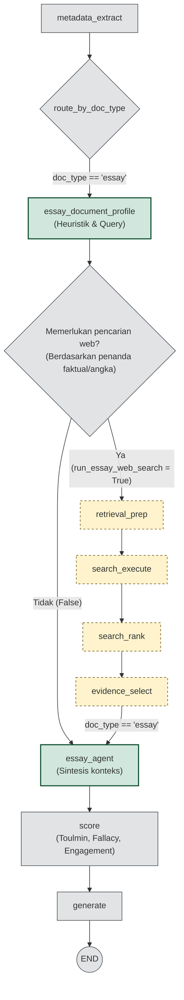

# Rencana: Essay Review — Toulmin, Fallacy Scan, Academic Engagement + Analytic Scoring

Dokumen ini untuk **review sebelum coding** dan **rencana eksekusi implementasi** (§13).

**Lokasi:** berada di **akar repositori** (`ai-review-engine/`), **sejajar** dengan folder `ai-agent/`. Referensi path kode dalam dokumen ini mengacu pada file di dalam **`ai-agent/`** (contoh: `app/graph/builder.py` → `ai-agent/app/graph/builder.py`).

Ruang lingkup disederhanakan: **tidak** memakai PEEL, IMRAD, Oxford hierarchy, atau kerangka struktural tambahan lain — fokus pada **tiga framework evaluatif** lalu **analytic scoring** (enam trait).

---

## 1. Tujuan (disederhanakan)

1. **Toulmin** — untuk setiap klaim utama: claim → evidence → warrant → backing → qualifier → rebuttal; penekanan khusus pada **warrant** (mengapa bukti relevan dengan klaim).
2. **Fallacy scan** — daftar tetap: strawman, ad hominem, false dichotomy, hasty generalization, slippery slope, circular reasoning; instruksi **hanya men-flag jika jelas di teks**, hindari false positive.
3. **Academic engagement** — apakah essay menanggapi posisi lain / literatur (they say), posisi penulis (I say), serta **counterargument dan sanggahan** bila relevan untuk jenis teksnya.
4. **Analytic scoring** — setelah tiga framework di atas, isi **enam trait** berbobot (skor 1–10 + feedback per trait) dalam satu objek JSON yang sama seperti sekarang.

**Search + konteks:** **heuristik** — jalankan retrieval/search hanya bila essay memenuhi kriteria ringkas (§7), bukan untuk setiap essay.

---

## 2. Keadaan kode sekarang (relevan)

| Area | Perilaku |
|------|-----------|
| Routing `doc_type` (setelah `metadata_extract`) | **`essay`** → node **`essay_document_profile`** · **`research`** → **`research_document_profile`** · **`bizplan`** → **`bizplan_document_profile`** (`route_by_doc_type` di `app/graph/builder.py`). Pola nama konsisten: `{doc_type}_document_profile`. |
| `essay_document_profile_node` | File `app/graph/nodes/essay_document_profile.py`. Menyiapkan `agent_context`, `search_queries = {}` (MVP). |
| Lanjutan per tipe | **Research:** `research_document_profile` → `retrieval_prep` → … → `research_agent` → `score`. **Essay (saat ini):** `essay_document_profile` → `score`. **Essay (target eksekusi):** `essay_document_profile` → (search opsional) → `essay_agent` → `score` — lihat **§13**. **Bizplan:** `bizplan_document_profile` → `score` (tetap sampai keputusan terpisah). |
| `score_node` | `DIMENSION_WEIGHTS["essay"]` enam key lama; weighted overall dari `dimensions`. |
| `ESSAY_SYSTEM_PROMPT` | `app/prompts/essay.py`. |
| `generate_node` | Menyusun `final_result` dengan bentuk tetap: `dimensions`, `summary`, `overall_feedback`, `strengths`, `improvements`, dll. |

### 2.1 Konvensi pipeline: profile dulu, jalur lanjut per `doc_type`

1. **Satu “gerbang” penamaan untuk semua `doc_type`:** masing-masing punya node **`{doc_type}_document_profile`** (essay / research / bizplan) — isinya persiapan konteks ringkas / profil dokumen sebelum logika khusus tipe berjalan.
2. **Setelah node profile, barulah pipeline masing-masing:** research sudah berlanjut ke subgraph retrieval + `research_agent`; essay dan bizplan saat ini singkat (profile → `score`); bizplan bisa punya jalur agent sendiri nanti tanpa mengubah pola nama profile.
3. **Essay — evolusi yang kamu maksud:** setelah **`essay_document_profile`** boleh ditambah node **`essay_agent`** (retrieval heuristik, reasoning tambahan, dll.) sehingga di diagram LangGraph terbaca jelas: *profile essay* lalu *agen essay*, baru `score`. Heuristik search (§7, fase 2 §9) secara desain cocok diisi di profile, di `essay_agent`, atau dibagi keduanya — yang penting edge graph: `essay_document_profile` → (`essay_agent` opsional) → `score`.

---

## 3. Enam trait analytic rubric (bobot total 1.0)

Tetap enam dimensi agar skor tersusun rapi; isi **narasi feedback** tiap trait mencerminkan hasil Toulmin + fallacy + engagement (tanpa field JSON terpisah — §6).

| Trait | Key | Bobot |
|-------|-----|-------|
| Thesis clarity | `thesis_clarity` | 0.20 |
| Argument coherence | `argument_coherence` | 0.25 |
| Evidence quality | `evidence_quality` | 0.20 |
| Structure & organization | `structure_organization` | 0.15 |
| Writing style & clarity | `writing_style_clarity` | 0.10 |
| Citation & academic integrity | `citation_integrity` | 0.10 |

Catatan isi (bukan framework terpisah di prompt): **structure_organization** = organisasi paragraf, alur, pengenalan–pengembangan–penutup yang wajar untuk **essay** (bukan checklist PEEL/IMRAD).

---

## 4. Alur kognitif dalam satu system prompt (empat blok berurutan)

Urutan untuk LLM **sebelum** mengisi JSON akhir:

1. **Framework 1 — Toulmin** — identifikasi klaim utama; per klaim: evidence, warrant (eksplisit/tidak), backing, qualifier, rebuttal.
2. **Framework 2 — Fallacy scan** — daftar fallacy tetap; jika tidak ada yang meyakinkan, nyatakan tidak terdeteksi.
3. **Framework 3 — Academic engagement** — respons terhadap posisi lain / sumber; counterargument & sanggahan bila relevan.
4. **Analytic scoring** — map hasil 1–3 ke enam trait: skor + `feedback` actionable per trait; lalu `summary`, `overall_feedback`, tepat **3** `strengths`, **3** `improvements`, plus **urutan prioritas revisi** (mis. paragraf terakhir di `overall_feedback` atau sebagai bagian dari `improvements`).

Tetap satu aturan teknis: **output hanya satu objek JSON** valid, tanpa markdown fence (selaras `CONTEXT_INSTRUCTIONS` essay).

---

## 5. Kontrak JSON (tetap sama untuk backend)

Bentuk yang diparse `score_node` dan dikirim ke `final_result` **tidak berubah** di level kontrak:

```json
{
  "dimensions": [
    { "key": "...", "name": "...", "weight": 0.0, "score": 0.0, "feedback": "..." }
  ],
  "overall_feedback": "...",
  "summary": "...",
  "strengths": ["...", "...", "..."],
  "improvements": ["...", "...", "..."]
}
```

- **Backend aman tanpa ubah kode** jika mereka hanya mengonsumsi `final_result` secara generik (mis. iterasi `dimensions`, tampilkan `key`/`name`/`score`/`feedback` dari respons API).
- **Perhatian:** jika ada kode yang **hardcode** key lama (`tesis_argumen`, `struktur_koherensi`, …) untuk logika bisnis atau UI, bagian itu perlu diselaraskan ke enam key baru — itu bukan perubahan bentuk JSON, tapi perubahan **nilai** `key` di dalam array.

`score_node` tetap mengupdate `DIMENSION_WEIGHTS["essay"]` agar selaras dengan enam `key` baru (satu-satunya perubahan wajib di agent untuk perhitungan bobot).

---

## 6. Rekomendasi: tanpa field JSON tambahan (minimal file / perubahan)

**Keputusan disarankan:** jangan tambah `toulmin_analysis`, `logical_fallacies`, atau blok terstruktur lain di output LLM untuk fase ini.

- Semua output Toulmin, fallacy, dan engagement **dilarutkan** ke dalam `feedback` per trait (dan bila perlu `overall_feedback` / `summary`).
- **Manfaat:** tidak perlu ubah `ReviewEngineState`, pass-through di `score_node`, atau `generate_node` untuk field baru; risiko kontrak Laravel/FE kecil.
- **Implementasi minimal:** cukup **satu file** baru di `app/rubrics/` (mis. `essay_review_framework.py`) berisi teks konstanta framework + instruksi bilingual + contoh JSON; `app/prompts/essay.py` mengimpor dan merakit string; **`score.py`** hanya update dict bobot + key essay; heuristik + `search_queries` untuk essay (fase terpisah) bisa di **`essay_document_profile.py`** dan/atau di node lanjutan **`essay_agent`** (setelah profile, sebelum `score`) bila kamu memecah tanggung jawab untuk kejelasan diagram.

Jika suatu saat UI minta struktur khusus (tabel fallacy), itu bisa jadi iterasi kedua dengan sengaja menambah field.

---

## 7. Search untuk essay — **heuristik**

Prinsip: **tidak** search untuk setiap essay; aktifkan hanya jika kondisi sederhana terpenuhi, contoh (disetel final saat coding):

- Essay memuat **minimal N** indikator klaim faktual / pernyataan empiris (angka, tahun, “menurut penelitian”, “data menunjukkan”, …), **atau**
- Panjang/token di atas ambang tertentu **dan** metadata/topik (jika ada) menunjuk essay informatif/argumentatif, **bukan** reflektif pendek.

Jika heuristik **lolos**: **`essay_document_profile_node`** dan/atau **`essay_agent_node`** (jika sudah ada di antara profile dan `score`) mengisi `search_queries` / memperkaya konteks; graph memakai jalur retrieval yang sudah ada (reuse node seperti di jalur research) atau kompres snippet ke `agent_context` / `review_context` sebelum `score` — detail edge ditulis saat implementasi agar selaras `app/graph/builder.py` (saat ini essay: `essay_document_profile` → `score`; nanti bisa `essay_document_profile` → `essay_agent` → `score` atau `essay_document_profile` → subgraph search → `essay_agent` → `score`).

Jika **tidak lolos**: perilaku seperti sekarang (potongan markdown saja), tanpa search.

---

## 8. Bahasa output — **bilingual**

Instruksi untuk LLM:

- **`name` / `label` tiap dimensi:** Indonesia + English singkat (mis. satu baris atau “ID / EN”).
- **`feedback`, `summary`, `overall_feedback`, `strengths`, `improvements`:** untuk setiap poin bermakna, gunakan pola ringkas **ID lalu EN** (atau paragraf ID diikuti paragraf EN) — satu format konsisten di seluruh output agar mudah dibaca manusia.

---

## 9. Fase ringkas (merujuk §13)

| Fase | Isi | Rincian |
|------|-----|--------|
| **A** | Rubrik + scoring essay | §13.4 langkah A |
| **B** | Pipeline profile → search → essay_agent | §13.4 langkah B |
| **C** | Integrasi konteks ke `score` + tes | §13.4 langkah C |

Detail urutan file, edge graph, dan keputusan LLM ada di **§13**.

---

## 10. Risiko & mitigasi (revisi)

| Risiko | Mitigasi |
|--------|----------|
| JSON invalid | Contoh JSON lengkap di prompt; suhu rendah; pembersihan fence yang ada. |
| False positive fallacy | Flag hanya dengan ancor teks pendek; boleh kosong. |
| Heuristik salah klasifikasi | Threshold konservatif (cenderung **tidak** search); log “essay_search_skipped” untuk tuning. |

---

## 11. Keputusan terverifikasi (dari kamu + rekomendasi §6)

| # | Keputusan |
|---|-----------|
| 1 | **Bahasa output:** bilingual (lihat §8). |
| 2 | **Key dimensi:** enam trait baru; **`final_result` bentuk sama** — backend yang konsumsi generik tidak wajib diubah; hanya waspada hardcode key lama. |
| 3 | **Search essay:** **heuristik** (lihat §7). |
| 4 | **Field terstruktur Toulmin/fallacy:** **tidak** di fase ini; cukup di `feedback` — **minimal perubahan file** (§6). |

---

## 12. Checklist verifikasi pasca-implementasi

- [ ] JSON parse sukses; `score_overall` = Σ bobot × skor untuk enam key baru.
- [ ] `final_result` top-level keys tidak berubah dari kontrak `generate_node` sekarang.
- [ ] Enam entri `dimensions` dengan key baru selalu terisi.
- [ ] Essay tanpa heuristik: tidak memanggil `search_execute`; tetap `essay_agent` → `score`.
- [ ] Essay dengan heuristik: hasil search masuk konteks yang dibaca `score_node` (prioritas jelas di `_select_context` atau setara).
- [ ] `essay_document_profile` tidak memuat prompt rubrik panjang — hanya profiling + konteks awal + query/gate.

**Eksekusi:** ikuti urutan **§13.4** (A → B → C).

---

## 13. Rencana eksekusi implementasi (pipeline essay)

Bagian ini mengunci desain yang disepakati: **profile essay** (mirip spirit `research_document_profile`) → **persiapan query + search** (reuse rantai retrieval) → **`essay_agent`** (konteks pasca-search, siap evaluasi) → **`score`** (JSON dimensi + bobot) → `generate`.

### 13.1 Diagram alur target



- **Satu jalur masuk `essay_agent`:** baik search dijalankan maupun dilewati, node **`essay_agent`** selalu dipanggil agar rubrik / reasoning selalu punya perilaku konsisten (agent membaca “tidak ada bukti web” jika relevan).
- **Subgraph search:** reuse node yang sama dengan jalur research (`retrieval_prep` … `evidence_select`) **atau** duplikasi edge paralel khusus essay yang memanggil node yang sama — yang penting satu implementasi search.

### 13.2 Tanggung jawab per node

| Node | Peran (essay) |
|------|----------------|
| **`essay_document_profile`** | Sejajar konsep **`research_document_profile`**: persiapan konteks dari dokumen (potongan/token aman), **profiling khusus essay** (topik, tipe tulisan, sinyal klaim faktual/angka/data — boleh LLM ringan + fallback defensif seperti research). **Tidak** memuat prompt rubrik Toulmin/fallacy panjang di sini. Output ke state: minimal `agent_context` awal, **`search_queries`** (atau struktur yang dibaca `retrieval_prep`), dan **flag / sinyal heuristik** (`run_essay_web_search` atau setara) untuk conditional edge di `builder`. |
| **`retrieval_prep` → … → `evidence_select`** | Hanya jalan jika heuristik memutuskan perlu web; isi query dari profile; hasil terpilih dikompresi ke **`review_context`** (atau field yang sudah dipakai pipeline evidence — disepakati satu nama untuk essay pasca-search). |
| **`essay_agent`** | Berjalan **setelah** search (atau setelah skip search). Membangun **konteks evaluasi terpadu**: teks essay (ringkas) + cuplikan profiling + **bukti web terpilih** bila ada. Di sinilah narasi rubrik (Toulmin, fallacy, engagement) **diterapkan terhadap bahan yang sudah lengkap** — bisa berupa satu panggilan LLM *synthesis* yang menulis `review_context` untuk tahap scoring, **atau** jika dipilih strategi satu-LLM, agent ini yang memanggil prompt rubrik + JSON dimensi (lihat §13.3). |
| **`score`** | Tetap memakai `ESSAY_SYSTEM_PROMPT` + kontrak JSON §5, dengan input konteks terbaik dari state (**utamakan `review_context` untuk essay** bila terisi, seperti research). Menghitung `score_overall` dari bobot §3. |

### 13.3 Strategi pemanggilan LLM (pilih saat coding; default disarankan)

| Strategi | Alur | Catatan |
|----------|------|--------|
| **Default (disarankan)** | `essay_agent` = LLM **synthesis** (essay + evidence → `review_context` padat, boleh menyebut klaim vs sumber); lalu **`score_node`** = satu LLM dengan rubrik §4 + JSON dimensi. | Kontrak JSON tetap terpusat di `score` / `essay` prompt; mudah diuji terpisah. |
| **Opsi (satu LLM)** | Rubrik + JSON dimensi sepenuhnya di **`essay_agent`** setelah search; `score_node` untuk essay hanya validasi/aggregate atau dilewati. | Mengurangi latensi/biaya; refactor lebih dalam (hindari duplikasi logika bobot). |

Dokumen ini **mengasumsikan default** baris pertama kecuali tim memutuskan lain di PR.

### 13.4 Urutan eksekusi kerja (checklist developer)

**A — Rubrik & scoring (bisa paralel dengan persiapan B, tapi tidak bergantung pada graph search)**

1. Tambah `app/rubrics/essay_review_framework.py` (Toulmin, fallacy list, engagement, bilingual, contoh JSON).
2. Update `app/prompts/essay.py` agar mengimpor dan merakit `ESSAY_SYSTEM_PROMPT` sesuai §3–§4, §8.
3. Update `DIMENSION_WEIGHTS["essay"]` dan prompt keys di `app/graph/nodes/score.py`; sesuaikan `CONTEXT_INSTRUCTIONS["essay"]` jika perlu.
4. Update tes yang mengikat key dimensi essay lama.

**B — Pipeline: profile → conditional search → essay_agent**

5. Perkaya **`essay_document_profile.py`**: profiling essay-specific (mirror pola defensif `research_document_profile.py`: input hemat token dari metadata + awal body), set **`search_queries`** / input `retrieval_prep`, set flag heuristik.
6. Tambah **`essay_agent.py`** + daftarkan node `essay_agent` di **`builder.py`**.
7. **Conditional edges** dari `essay_document_profile`: jika perlu web → `retrieval_prep` → … → `evidence_select` → `essay_agent`; jika tidak → langsung `essay_agent`.
8. Hapus edge langsung `essay_document_profile` → `score` (diganti `essay_document_profile` → … → `essay_agent` → `score`).
9. Sesuaikan **`retrieval_prep`** (dan bila perlu node berikutnya) agar membaca query/state dari jalur **essay** tanpa merusak jalur research (branch pada `doc_type` atau field khusus).

**C — Integrasi konteks & verifikasi**

10. **`_select_context`** di `score.py`: untuk `doc_type == "essay"`, prioritas sama seperti research — gunakan **`review_context`** jika terisi (pasca `essay_agent` / evidence), fallback `agent_context` / `raw_markdown`.
11. Batasi panjang konteks agregat (token) di `essay_agent` / evidence step.
12. Uji e2e: (i) essay reflektif pendek → tidak search, tetap skor; (ii) essay dengan angka/klaim faktual → search (mock jika perlu), `review_context` terisi, skor sukses.
13. Update **`tests/test_graph.py`** (jumlah node, edge essay), dan dokumentasi diagram bila ada.

### 13.5 Hal teknis yang tidak boleh dilupakan

- **Essay vs research di retrieval:** instruksi / template query untuk essay condong ke *verifikasi fakta, definisi, posisi umum di literatur*, bukan hanya “paper terkait” — bisa per kondisional di `retrieval_prep` atau prompt internal berdasarkan `doc_type`.
- **Logging:** `log_step` di profile, tiap fase search, `essay_agent`, dan `score` agar Laravel/FE bisa melacak skip vs jalur search.
- **Bizplan:** tidak berubah dalam rencana ini (`bizplan_document_profile` → `score` tetap sampai ada keputusan terpisah).

---
